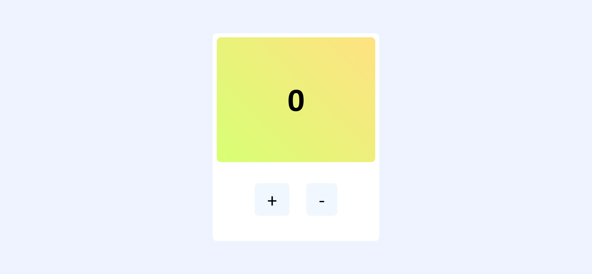

# 🔢 Counter App

A simple and responsive **Counter Application** built using **HTML, CSS, and JavaScript**.  
This project demonstrates the use of **DOM Manipulation** and **Event Listeners** in JavaScript.  

---

## 🚀 Features
- ➕ Increment the counter  
- ➖ Decrement the counter  
- 🔄 Reset the counter  
- Responsive and minimal UI  
- Beginner-friendly project  

---

## 🛠️ Technologies Used
- **HTML5** – Structure of the app  
- **CSS3** – Styling and layout  
- **JavaScript (ES6)** – Logic and interactivity  

---

## 📸 Preview
  

---

## 📂 How to Run the Project
1. Clone this repository  
   ```bash
   git clone https://github.com/your-username/counter-app.git
